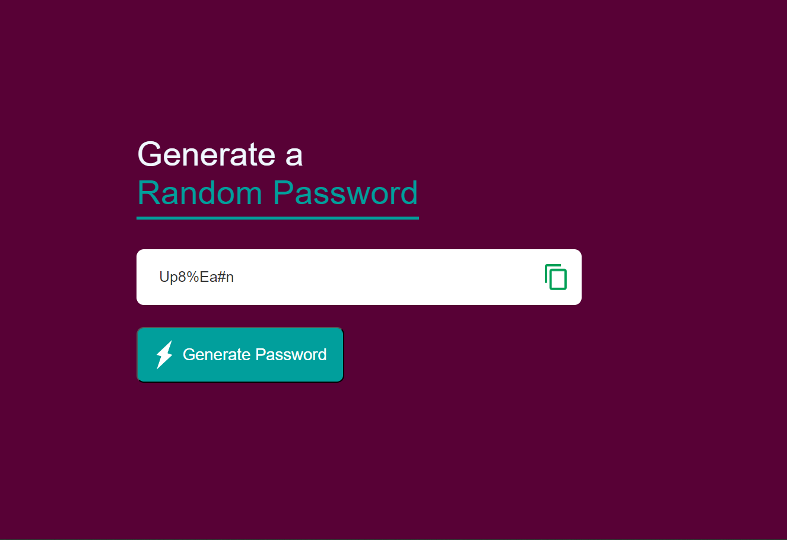

# Password Generator

A simple web-based **Random Password Generator** that creates a strong password and allows you to copy it to your clipboard.

## Features
- Generates a random password of 8 characters (uppercase, lowercase, numbers, special symbols).
- Copy password to clipboard functionality.

## Project Structure
- `index.html`: Contains the structure of the web page.
- `style.css`: Adds styling for the layout and design.
- `script.js`: Handles the logic for password generation and copying.
- `images/`: Contains the icon images used in the app (copy icon, generate button).

## How to Use
1. Open `index.html` in your browser.
2. Click **Generate Password** to create a random password.
3. Click the **Copy** icon to copy the password to your clipboard.

## Picture

## Technologies Used
- HTML
- CSS
- JavaScript
